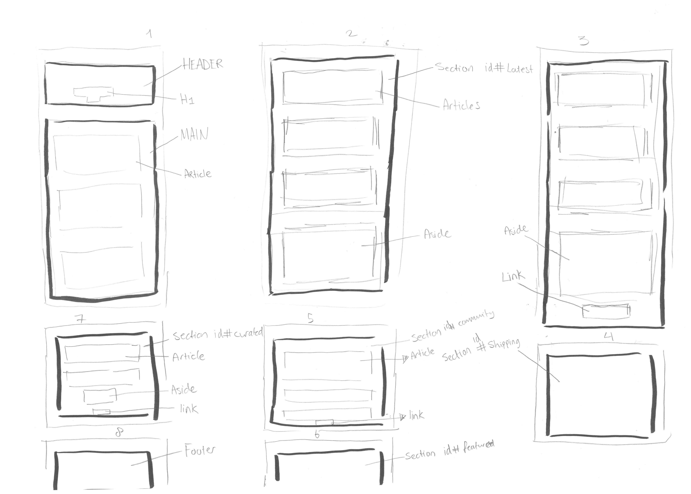

# frontend-responsive-design
Opdracht voor het vak Frontend @CMD Amsterdam

Ik heb gekozen om de website www.smashingmagazine.com na te maken door html, css en js te gebruiken. Eerst ga ik focussen op de structuur van de website, dus alles wat in de html zit overnemen. Vervolgens ga ik het vormgeven met css en tot slot micro interacties designen met javascript. 

Om de structuur van de html te begrijpen heb ik het even geschetst met de tags die ik nodig heb. Hier is de schets:

## Criteria
### 1.) De HTML is gestructureerd en semantisch opgemaakt

### 2.) De basis principes van CSS zijn begrepen en toegepast
[Handige bron](https://codepen.io/joostf)

### 3.) De site is responsive

### 4.) Er is een werkende interactie met js gemaakt

### 5.) Er is geëxperimenteerd met verschillende technieken
